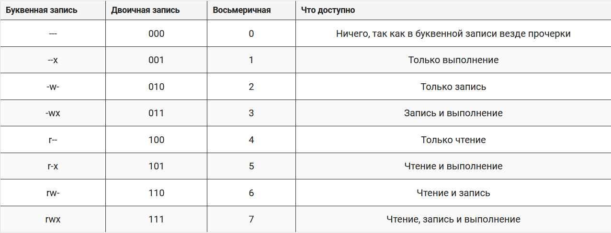

# Работа с текстом

Текст можно сделать __жирным__, *курсивом* или ***Жирным курсивом***
***
Можно добавить код:
```
import this
```
___
Можно добавить цитату:
> Простое лучше чем сложное  
Явное лучше чем неявное
## Ссылки и картинки
ссылка  
[Хабр](https://habr.com/ru/feed/)

картинка  


картинка-ссылка  
[](https://github.com)
### Таблицы
Номер  | Название | Кол-во
:------|----------|----------:
1|Компьютер|2
2|Мышь|1
3 | Клавиатура|1
